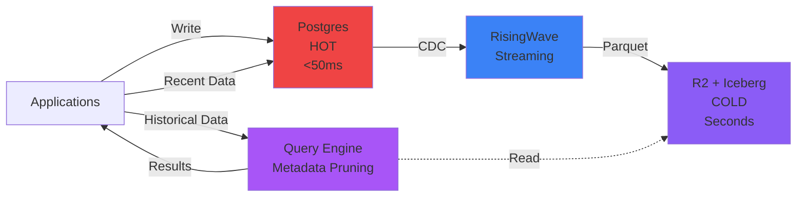
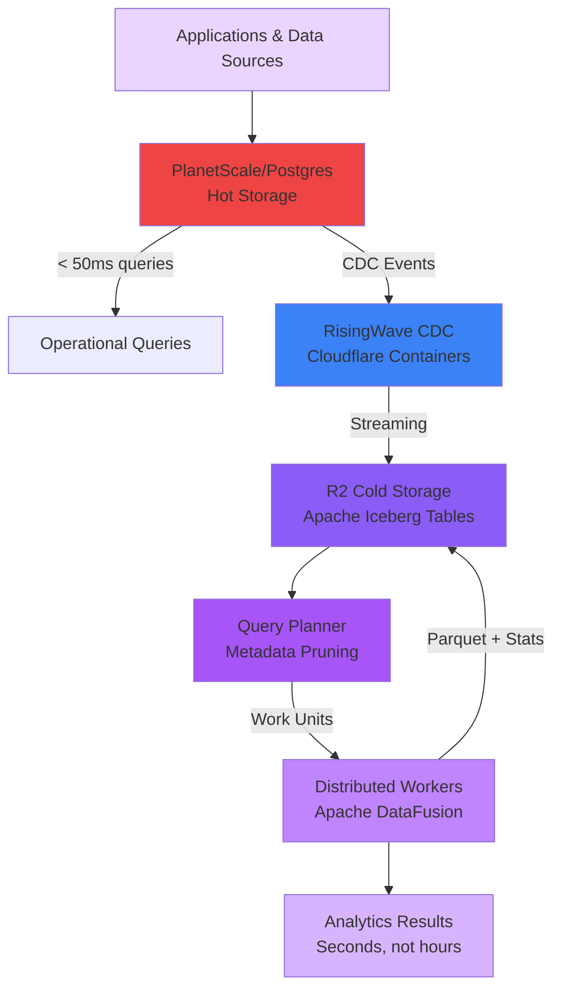
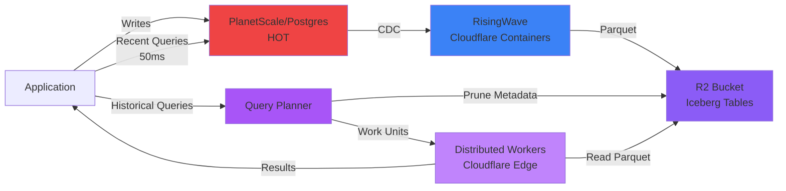

---
# You can also start simply with 'default'
theme: seriph
# some information about your slides (markdown enabled)
title: Fig - Edge-first data platform
info: |
  ## Fig - Serverless Data Platform on the Edge
  Built on PlanetScale/Postgres (hot), RisingWave CDC, and Apache Iceberg (cold)
  
  Inspired by Cloudflare R2 SQL - Query petabytes without servers
  Distributed query engine with intelligent metadata pruning

  Learn more at [Sli.dev](https://sli.dev)
# apply unocss classes to the current slide
class: text-center
background: '#F5F5F0'
# https://sli.dev/features/drawing
drawings:
  persist: false
# slide transition: https://sli.dev/guide/animations.html#slide-transitions
transition: slide-left
# enable MDC Syntax: https://sli.dev/features/mdc
mdc: true
# open graph
seoMeta:
  ogImage: https://cover.sli.dev
  ogTitle: Fig - Edge-first data platform
  ogDescription: The serverless data platform that eliminates data engineering - Built to challenge Snowflake & Databricks
routerMode: hash
author: Matthew Aylward
addons:
  - excalidraw

---

<div class="flex flex-col items-center justify-center h-full">
  
  

  <h2 class="text-3xl mb-6">Serverless SQL on the Edge</h2>
  <p class="text-xl mb-8">Query petabytes without servers</p>
  
  <p class="text-sm italic mb-12">Matthew Aylward, Jan Nelis</p>


<div @click="$slidev.nav.next" class="py-2 px-6 bg-purple-600 text-white rounded-lg hover:bg-purple-700 cursor-pointer">
  Get Started <carbon:arrow-right class="inline" />
</div>

<div class="mt-12 text-lg">
  <div class="flex items-center justify-center space-x-12">
    <div class="flex flex-col items-center">
      <carbon:flash class="text-4xl mb-2 text-purple-400" />
      <span class="text-sm">Hot: PlanetScale/Postgres</span>
    </div>
    <div class="flex flex-col items-center">
      <carbon:data-base class="text-4xl mb-2 text-purple-500" />
      <span class="text-sm">CDC: RisingWave Streaming</span>
    </div>
    <div class="flex flex-col items-center">
      <carbon:globe class="text-4xl mb-2 text-purple-600" />
      <span class="text-sm">Cold: R2 + Iceberg</span>
    </div>
  </div>
</div>

<div class="abs-br m-6 text-xl">
  <button @click="$slidev.nav.openInEditor()" title="Open in Editor" class="slidev-icon-btn">
    <carbon:edit />
  </button>
  <a href="https://github.com/slidevjs/slidev" target="_blank" class="slidev-icon-btn">
    <carbon:logo-github />
  </a>
</div>
  
</div>


<!--
Welcome to Fig - a serverless data platform inspired by Cloudflare R2 SQL. We use PlanetScale/Postgres for hot storage, RisingWave for CDC streaming to Apache Iceberg on R2 cold storage, with a distributed query engine that can query petabytes without managing servers.
-->

---
transition: slide-up
background: '#F5F5F0'
---

# What is Fig?

<div class="mt-8 space-y-6">

<div v-click="1" class="text-lg">
A <strong>serverless data platform</strong> that eliminates data engineering complexity
</div>

<div v-click="2" class="grid grid-cols-3 gap-4 mt-8">
<div class="bg-red-50 dark:bg-red-900/20 p-4 rounded-lg text-center">
  <div class="text-3xl mb-2">🔥</div>
  <div class="font-bold text-red-700">Hot Storage</div>
  <div class="text-xs mt-2">Client's DB or PlanetScale/Postgres</div>
  <div class="text-xs opacity-70">Sub-50ms queries</div>
</div>

<div class="bg-blue-50 dark:bg-blue-900/20 p-4 rounded-lg text-center">
  <div class="text-3xl mb-2">🌊</div>
  <div class="font-bold text-blue-700">CDC (Change Data Capture) Streaming</div>
  <div class="text-xs mt-2">RisingWave</div>
  <div class="text-xs opacity-70">Real-time replication</div>
</div>

<div class="bg-purple-50 dark:bg-purple-900/20 p-4 rounded-lg text-center">
  <div class="text-3xl mb-2">❄️</div>
  <div class="font-bold text-purple-700">Cold Storage</div>
  <div class="text-xs mt-2">Cloudflare R2 (Apache Iceberg)</div>
  <div class="text-xs opacity-70">Petabyte analytics</div>
</div>
</div>

<div v-click="3" class="mt-8 text-center text-sm italic bg-purple-100 dark:bg-purple-900/20 p-3 rounded">
Built on Cloudflare's architecture
</div>

</div>

<!--
Fig is a complete data platform that combines three proven technologies into one serverless solution. No more managing clusters, no more complex pipelines.
-->

---
transition: fade-out
background: '#F5F5F0'
---

# The Problem

<div class="mt-8">

<h2 class="text-2xl mb-6">Companies face an impossible choice:</h2>

<div class="grid grid-cols-2 gap-6">

<div v-click="1" class="bg-red-50 dark:bg-red-900/20 p-6 rounded-lg">
<h3 class="font-bold text-xl mb-4 text-red-700">Managed Platforms</h3>
<div class="space-y-2 text-sm">
<div>❌ <strong>Snowflake/Databricks</strong></div>
<div class="ml-6">• Expensive ($18-20k/mo for 100TB)</div>
<div class="ml-6">• Proprietary formats</div>
<div class="ml-6">• Vendor lock-in</div>
<div class="ml-6">• High egress fees</div>
</div>
</div>

<div v-click="2" class="bg-orange-50 dark:bg-orange-900/20 p-6 rounded-lg">
<h3 class="font-bold text-xl mb-4 text-orange-700">Self-Managed</h3>
<div class="space-y-2 text-sm">
<div>❌ <strong>Spark/Trino/Presto</strong></div>
<div class="ml-6">• Months of setup</div>
<div class="ml-6">• Complex cluster management</div>
<div class="ml-6">• Constant maintenance</div>
<div class="ml-6">• Need specialized expertise</div>
</div>
</div>

</div>

<div v-click="3" class="mt-8 text-center text-lg font-bold text-purple-700">
Teams spend more time on infrastructure than extracting value from data
</div>

</div>

<!--
This is the pain point we're solving. Companies either pay massive amounts to Snowflake/Databricks, or they spend months building and maintaining their own infrastructure.
-->

---
transition: slide-up
background: '#F5F5F0'
---

# The Fig Solution

<div class="mt-4">

<div class="text-center mb-6 text-lg font-semibold">
Three-tier architecture with <span class="text-purple-600">intelligent metadata pruning</span>
</div>



<div class="mt-6 grid grid-cols-2 gap-4">
<div v-click="1" class="bg-green-50 dark:bg-green-900/20 p-3 rounded text-sm">
<strong>Operational Queries:</strong> Direct to hot storage, sub-50ms
</div>

<div v-click="2" class="bg-blue-50 dark:bg-blue-900/20 p-3 rounded text-sm">
<strong>Historical Analytics:</strong> Serverless query engine, seconds not hours
</div>
</div>

</div>

<!--
Our solution provides the best of both worlds: fast operational queries on hot storage, and powerful analytics on cold storage without managing any clusters.
-->

---
transition: fade-out
background: '#F5F5F0'
---

# Key Innovation: Metadata Pruning

<div class="mt-4">

<div class="text-center text-lg mb-6">
<strong class="text-purple-600">Query petabytes by reading only megabytes</strong>
</div>

<div class="grid grid-cols-3 gap-3">

<div v-click="1" class="bg-purple-50 dark:bg-purple-900/20 p-4 rounded-lg">
<div class="font-bold text-center mb-2">1. Partition Pruning</div>
<div class="text-xs text-center mb-3 opacity-70">Manifest List</div>
<div class="text-xs">
Skip entire partitions (days, regions, etc.)
<div class="mt-2 font-mono text-xs bg-white dark:bg-gray-800 p-2 rounded">
day = '2025-01-15'<br/>
→ Skip 364 other days
</div>
</div>
</div>

<div v-click="2" class="bg-purple-100 dark:bg-purple-900/30 p-4 rounded-lg">
<div class="font-bold text-center mb-2">2. File Pruning</div>
<div class="text-xs text-center mb-3 opacity-70">Manifest Files</div>
<div class="text-xs">
Skip files using min/max stats
<div class="mt-2 font-mono text-xs bg-white dark:bg-gray-800 p-2 rounded">
status = 500<br/>
→ Skip files [200-404]
</div>
</div>
</div>

<div v-click="3" class="bg-purple-200 dark:bg-purple-900/40 p-4 rounded-lg">
<div class="font-bold text-center mb-2">3. Row Group Pruning</div>
<div class="text-xs text-center mb-3 opacity-70">Parquet Footers</div>
<div class="text-xs">
Skip row groups within files
<div class="mt-2 font-mono text-xs bg-white dark:bg-gray-800 p-2 rounded">
1000-row chunks<br/>
→ Read only matches
</div>
</div>
</div>

</div>

<div v-click="4" class="mt-6 text-center">
<div class="inline-block bg-gradient-to-r from-purple-500 to-blue-500 text-white px-6 py-3 rounded-lg font-bold">
Result: 99%+ of data skipped before reading a single byte
</div>
</div>

</div>

<!--
This is our secret sauce. By using Apache Iceberg's metadata hierarchy, we can skip 99% of data before reading anything. This is what Cloudflare proved works at petabyte scale.
-->

---
transition: slide-up
background: '#F5F5F0'
---

# Value Proposition

<div class="mt-6">

<div class="grid grid-cols-3 gap-4">

<div class="text-center">
<div class="text-4xl mb-2">🍊</div>
<div class="font-bold text-lg">Fig</div>
</div>

<div class="text-center">
<div class="text-4xl mb-2">❄️</div>
<div class="font-bold text-lg">Snowflake</div>
</div>

<div class="text-center">
<div class="text-4xl mb-2">🧱</div>
<div class="font-bold text-lg">Databricks</div>
</div>

</div>

<div class="mt-4">

| Metric | Fig | Snowflake | Databricks |
|--------|:---:|:---------:|:----------:|
| **Setup Time** | Hours | Days | Weeks |
| **Operations** | Zero | Medium | High |
| **Hot Queries** | <50ms | <100ms | N/A |
| **Cold Queries** | Seconds | Minutes | Minutes |
| **Cost (100TB)** | **$3.5k/mo** | $18k/mo | $19k/mo |
| **Egress Fees** | $0 | High | High |
| **Vendor Lock-in** | None | High | Medium |

</div>

<div class="mt-8 grid grid-cols-3 gap-4 text-center">
<div v-click="1" class="bg-green-100 dark:bg-green-900/20 p-3 rounded font-bold text-green-700">
80% cheaper
</div>
<div v-click="2" class="bg-blue-100 dark:bg-blue-900/20 p-3 rounded font-bold text-blue-700">
10x simpler
</div>
<div v-click="3" class="bg-purple-100 dark:bg-purple-900/20 p-3 rounded font-bold text-purple-700">
Infinitely scalable
</div>
</div>

</div>

<!--
The numbers speak for themselves. We're 80% cheaper than Snowflake or Databricks, 10x simpler to operate, and built on open standards so you're never locked in.
-->

---
transition: fade-out
background: '#F5F5F0'
---

# Technical Stack

<div class="mt-8 space-y-6">

<div v-click="1" class="flex items-center gap-4 bg-red-50 dark:bg-red-900/20 p-4 rounded-lg">
<div class="text-4xl">🔥</div>
<div class="flex-1">
<div class="font-bold text-red-700">Hot: PlanetScale/Postgres</div>
<div class="text-sm opacity-70">Operational queries on recent data</div>
</div>
<div class="text-right text-sm">
<div class="font-mono font-bold text-red-600">&lt;50ms</div>
<div class="text-xs">latency</div>
</div>
</div>

<div v-click="2" class="flex items-center gap-4 bg-blue-50 dark:bg-blue-900/20 p-4 rounded-lg">
<div class="text-4xl">🌊</div>
<div class="flex-1">
<div class="font-bold text-blue-700">CDC: RisingWave on Cloudflare</div>
<div class="text-sm opacity-70">Real-time replication to cold storage</div>
</div>
<div class="text-right text-sm">
<div class="font-mono font-bold text-blue-600">&lt;1s</div>
<div class="text-xs">lag</div>
</div>
</div>

<div v-click="3" class="flex items-center gap-4 bg-purple-50 dark:bg-purple-900/20 p-4 rounded-lg">
<div class="text-4xl">❄️</div>
<div class="flex-1">
<div class="font-bold text-purple-700">Cold: R2 + Apache Iceberg</div>
<div class="text-sm opacity-70">Petabyte-scale analytics with open formats</div>
</div>
<div class="text-right text-sm">
<div class="font-mono font-bold text-purple-600">Seconds</div>
<div class="text-xs">queries</div>
</div>
</div>

<div v-click="4" class="flex items-center gap-4 bg-green-50 dark:bg-green-900/20 p-4 rounded-lg">
<div class="text-4xl">⚡</div>
<div class="flex-1">
<div class="font-bold text-green-700">Query: Apache DataFusion on Edge</div>
<div class="text-sm opacity-70">Distributed execution, serverless</div>
</div>
<div class="text-right text-sm">
<div class="font-mono font-bold text-green-600">Auto-scale</div>
<div class="text-xs">workers</div>
</div>
</div>

</div>

<!--
Every component is proven at scale. PlanetScale/Postgres for hot data, RisingWave for CDC, R2 and Iceberg for cold storage, DataFusion for queries. All open source or open standards.
-->

---
transition: slide-up
background: '#F5F5F0'
---

# Why It Works

<div class="mt-8 space-y-6">

<div v-click="1" class="bg-blue-50 dark:bg-blue-900/20 p-4 rounded-lg">
<div class="flex items-start gap-3">
<div class="text-2xl">🏢</div>
<div>
<div class="font-bold mb-1">Proven by Cloudflare</div>
<div class="text-sm">Cloudflare uses this exact architecture (R2 SQL) to query their own petabytes of data at scale</div>
</div>
</div>
</div>

<div v-click="2" class="bg-purple-50 dark:bg-purple-900/20 p-4 rounded-lg">
<div class="flex items-start gap-3">
<div class="text-2xl">📊</div>
<div>
<div class="font-bold mb-1">Iceberg metadata enables intelligent pruning</div>
<div class="text-sm">Apache Iceberg's rich metadata structure makes 99%+ pruning possible</div>
</div>
</div>
</div>

<div v-click="3" class="bg-green-50 dark:bg-green-900/20 p-4 rounded-lg">
<div class="flex items-start gap-3">
<div class="text-2xl">⚡</div>
<div>
<div class="font-bold mb-1">Streaming pipeline (start early, finish early)</div>
<div class="text-sm">Begin execution immediately, stop as soon as we have the answer</div>
</div>
</div>
</div>

<div v-click="4" class="bg-orange-50 dark:bg-orange-900/20 p-4 rounded-lg">
<div class="flex items-start gap-3">
<div class="text-2xl">🌍</div>
<div>
<div class="font-bold mb-1">Distributed edge execution</div>
<div class="text-sm">Leverage Cloudflare's global network for massively parallel processing</div>
</div>
</div>
</div>

<div v-click="5" class="bg-yellow-50 dark:bg-yellow-900/20 p-4 rounded-lg">
<div class="flex items-start gap-3">
<div class="text-2xl">🔓</div>
<div>
<div class="font-bold mb-1">Open standards (no lock-in)</div>
<div class="text-sm">Parquet, Iceberg, Arrow - your data stays portable</div>
</div>
</div>
</div>

</div>

<!--
This isn't experimental. Cloudflare proved this works at massive scale. We're building on their shoulders with proven open source technologies.
-->

---
transition: fade-out
background: '#F5F5F0'
---

# Implementation Roadmap

<div class="mt-6">

<div class="grid grid-cols-3 gap-4">

<div v-click="1" class="bg-blue-50 dark:bg-blue-900/20 p-6 rounded-lg">
<div class="text-center mb-4">
<div class="text-3xl font-bold text-blue-600">Phase 1</div>
<div class="text-sm opacity-70">6 weeks</div>
</div>
<div class="space-y-2 text-sm">
<div class="font-bold mb-2">Proof of Concept</div>
<div>• Set up infrastructure</div>
<div>• Load sample data</div>
<div>• Validate pruning efficiency</div>
<div>• Measure performance</div>
</div>
<div class="mt-4 pt-4 border-t border-blue-200 text-xs text-center">
<strong>Goal:</strong> Prove &gt;99% pruning
</div>
</div>

<div v-click="2" class="bg-purple-50 dark:bg-purple-900/20 p-6 rounded-lg">
<div class="text-center mb-4">
<div class="text-3xl font-bold text-purple-600">Phase 2</div>
<div class="text-sm opacity-70">3-4 months</div>
</div>
<div class="space-y-2 text-sm">
<div class="font-bold mb-2">Build Query Engine</div>
<div>• Develop planner (Rust)</div>
<div>• Integrate DataFusion</div>
<div>• Deploy to Cloudflare</div>
<div>• Add monitoring</div>
</div>
<div class="mt-4 pt-4 border-t border-purple-200 text-xs text-center">
<strong>Goal:</strong> Production-ready
</div>
</div>

<div v-click="3" class="bg-green-50 dark:bg-green-900/20 p-6 rounded-lg">
<div class="text-center mb-4">
<div class="text-3xl font-bold text-green-600">Phase 3</div>
<div class="text-sm opacity-70">2-3 months</div>
</div>
<div class="space-y-2 text-sm">
<div class="font-bold mb-2">Production Deploy</div>
<div>• Migrate historical data</div>
<div>• Parallel run & validate</div>
<div>• Customer cutover</div>
<div>• Optimize & scale</div>
</div>
<div class="mt-4 pt-4 border-t border-green-200 text-xs text-center">
<strong>Goal:</strong> Live customers
</div>
</div>

</div>

<div v-click="4" class="mt-6 grid grid-cols-2 gap-4">
<div class="bg-orange-50 dark:bg-orange-900/20 p-4 rounded text-center">
<div class="text-sm opacity-70 mb-1">First Year Investment</div>
<div class="text-2xl font-bold text-orange-600">$150-200k</div>
<div class="text-xs mt-1">15-20 person-months</div>
</div>

<div class="bg-green-50 dark:bg-green-900/20 p-4 rounded text-center">
<div class="text-sm opacity-70 mb-1">Annual Savings (per customer)</div>
<div class="text-2xl font-bold text-green-600">$200k+</div>
<div class="text-xs mt-1">80% platform cost reduction</div>
</div>
</div>

</div>

<!--
Realistic timeline: 6-9 months to production. First year investment is $150-200k, but each customer saves $200k+ annually. ROI is 6-12 months.
-->

---
transition: slide-up
background: '#F5F5F0'
---

# Business Model & Market

<div class="mt-6 grid grid-cols-2 gap-6">

<div>
<h3 class="font-bold text-xl mb-4">Target Market</h3>

<div v-click="1" class="space-y-3 text-sm">
<div class="bg-blue-50 dark:bg-blue-900/20 p-3 rounded">
<strong>Primary:</strong> Data-intensive companies
<div class="text-xs mt-1 opacity-70">SaaS, fintech, e-commerce with 10TB+ data</div>
</div>

<div class="bg-purple-50 dark:bg-purple-900/20 p-3 rounded">
<strong>Pain Point:</strong> Paying $50k-200k/mo to Snowflake/Databricks
<div class="text-xs mt-1 opacity-70">Want to reduce costs without losing performance</div>
</div>

<div class="bg-green-50 dark:bg-green-900/20 p-3 rounded">
<strong>Opportunity:</strong> $10B+ data platform market
<div class="text-xs mt-1 opacity-70">Growing 25% annually</div>
</div>
</div>

<div v-click="2" class="mt-6">
<h4 class="font-semibold mb-2">Swiss Market Advantage</h4>
<ul class="text-xs space-y-1">
<li>✅ Data sovereignty requirements</li>
<li>✅ Cost-conscious enterprises</li>
<li>✅ Technical talent pool</li>
<li>✅ Proximity to EU market</li>
</ul>
</div>

</div>

<div>
<h3 class="font-bold text-xl mb-4">Revenue Model</h3>

<div v-click="3" class="space-y-3 text-sm">
<div class="bg-orange-50 dark:bg-orange-900/20 p-3 rounded">
<strong>Usage-Based Pricing</strong>
<div class="mt-2 space-y-1 text-xs">
<div>• Storage: $0.02/GB/month</div>
<div>• Query compute: $0.10/GB processed</div>
<div>• Hot storage: $0.30/GB/month</div>
</div>
<div class="mt-2 pt-2 border-t border-orange-200 text-xs font-semibold">
Avg customer: $5-10k/mo
</div>
</div>

<div class="bg-yellow-50 dark:bg-yellow-900/20 p-3 rounded">
<strong>Enterprise Plans</strong>
<div class="mt-2 space-y-1 text-xs">
<div>• Dedicated support</div>
<div>• Custom SLAs</div>
<div>• Private deployment option</div>
</div>
<div class="mt-2 pt-2 border-t border-yellow-200 text-xs font-semibold">
Premium: $25-50k/mo
</div>
</div>
</div>

<div v-click="4" class="mt-6">
<h4 class="font-semibold mb-2">Customer Economics</h4>
<div class="text-xs bg-green-50 dark:bg-green-900/20 p-3 rounded">
<div>Customer pays us: <strong>$10k/mo</strong></div>
<div>Was paying Snowflake: <strong>$50k/mo</strong></div>
<div class="mt-2 pt-2 border-t border-green-200">
<strong>Customer saves: $40k/mo (80%)</strong>
</div>
</div>
</div>

</div>

</div>

<!--
Our target is companies paying Snowflake or Databricks $50-200k per month. We can save them 80% while providing better performance. The Swiss market is perfect: data sovereignty concerns, cost-conscious enterprises, and proximity to EU.
-->

---
transition: fade-out
background: '#F5F5F0'
---

# Competitive Advantage

<div class="mt-8">

<div class="grid grid-cols-2 gap-6">

<div>
<h3 class="font-bold text-xl mb-4 text-purple-600">Why We Win</h3>

<div v-click="1" class="space-y-3 text-sm">
<div class="flex items-start gap-2">
<div class="text-xl">🚀</div>
<div>
<strong>Technical Moat:</strong> Metadata pruning expertise is rare. Most companies don't understand Iceberg at this level.
</div>
</div>

<div class="flex items-start gap-2">
<div class="text-xl">💰</div>
<div>
<strong>Cost Advantage:</strong> 80% cheaper than incumbents. Serverless = no idle compute costs.
</div>
</div>

<div class="flex items-start gap-2">
<div class="text-xl">🔓</div>
<div>
<strong>No Lock-in:</strong> Open formats (Parquet, Iceberg). Customers keep their data portable.
</div>
</div>

<div class="flex items-start gap-2">
<div class="text-xl">⚡</div>
<div>
<strong>Better Performance:</strong> Hot/cold tiering means optimal performance for every query type.
</div>
</div>

<div class="flex items-start gap-2">
<div class="text-xl">🏗️</div>
<div>
<strong>Zero Ops:</strong> Customers don't manage any infrastructure. True serverless.
</div>
</div>
</div>

</div>

<div>
<h3 class="font-bold text-xl mb-4 text-red-600">Risks & Mitigation</h3>

<div v-click="2" class="space-y-3 text-sm">
<div class="bg-red-50 dark:bg-red-900/20 p-3 rounded">
<strong>Risk:</strong> Cloudflare could compete
<div class="text-xs mt-1">
<strong>Mitigation:</strong> We add hot/cold tiering + CDC. Different positioning.
</div>
</div>

<div class="bg-orange-50 dark:bg-orange-900/20 p-3 rounded">
<strong>Risk:</strong> Snowflake price cuts
<div class="text-xs mt-1">
<strong>Mitigation:</strong> Our cost structure is fundamentally lower. They can't match our prices.
</div>
</div>

<div class="bg-yellow-50 dark:bg-yellow-900/20 p-3 rounded">
<strong>Risk:</strong> Technical complexity
<div class="text-xs mt-1">
<strong>Mitigation:</strong> POC proves feasibility. Cloudflare validated the approach.
</div>
</div>

<div class="bg-blue-50 dark:bg-blue-900/20 p-3 rounded">
<strong>Risk:</strong> Market adoption
<div class="text-xs mt-1">
<strong>Mitigation:</strong> Strong ROI story (80% savings). Target cost-conscious buyers first.
</div>
</div>
</div>

</div>

</div>

</div>

<!--
Our competitive advantages are real and defensible: technical expertise in metadata pruning, fundamental cost advantage, open standards, and true serverless operation. Risks are manageable.
-->

---
layout: center
class: text-center
background: '#F5F5F0'
---

# Next Steps

<div class="mt-12 space-y-8">

<div v-click="1" class="text-left max-w-2xl mx-auto space-y-4">

<div class="flex items-start gap-4 bg-blue-50 dark:bg-blue-900/20 p-4 rounded-lg">
<div class="text-3xl font-bold text-blue-600">1</div>
<div>
<div class="font-bold">This Week: Stakeholder Buy-in</div>
<div class="text-sm">Present to potential co-founders, advisors, early supporters</div>
</div>
</div>

<div class="flex items-start gap-4 bg-purple-50 dark:bg-purple-900/20 p-4 rounded-lg">
<div class="text-3xl font-bold text-purple-600">2</div>
<div>
<div class="font-bold">Next Month: POC Environment</div>
<div class="text-sm">Deploy proof of concept, load sample data, validate pruning</div>
</div>
</div>

<div class="flex items-start gap-4 bg-green-50 dark:bg-green-900/20 p-4 rounded-lg">
<div class="text-3xl font-bold text-green-600">3</div>
<div>
<div class="font-bold">3-6 Months: Build Query Engine</div>
<div class="text-sm">Develop production system with Rust + DataFusion</div>
</div>
</div>

<div class="flex items-start gap-4 bg-orange-50 dark:bg-orange-900/20 p-4 rounded-lg">
<div class="text-3xl font-bold text-orange-600">4</div>
<div>
<div class="font-bold">6-12 Months: First Customers</div>
<div class="text-sm">Migrate production workloads, realize cost savings, iterate</div>
</div>
</div>

</div>

<div v-click="2" class="mt-12 text-xl font-bold text-purple-600">
Ready to build the future of data platforms?
</div>

</div>

<!--
Clear next steps with realistic timeline. We can validate the concept in weeks, build in months, and have paying customers within a year.
-->

---
layout: center
class: text-center
background: 'linear-gradient(to right, #8b5cf6, #3b82f6)'
---

<div class="text-white">

<h1 class="text-5xl font-bold mb-8">Fig Platform</h1>

<div class="text-2xl mb-4 opacity-90">
Query petabytes without servers
</div>

<div class="text-xl mb-12 opacity-75">
80% cheaper · 10x simpler · Infinitely scalable
</div>

<div class="grid grid-cols-3 gap-8 max-w-3xl mx-auto text-sm">
<div>
<div class="text-3xl mb-2">🔥</div>
<div>Hot Storage</div>
<div class="opacity-75">&lt;50ms</div>
</div>
<div>
<div class="text-3xl mb-2">🌊</div>
<div>CDC Streaming</div>
<div class="opacity-75">&lt;1s lag</div>
</div>
<div>
<div class="text-3xl mb-2">❄️</div>
<div>Cold Analytics</div>
<div class="opacity-75">Seconds</div>
</div>
</div>

<div class="mt-16 text-lg">
<div>Matthew Aylward & Jan Nelis</div>
<div class="text-sm opacity-75 mt-2">matthew@fig.io · jan@fig.io</div>
</div>

</div>

<!--
Thank you! Fig is the future of data platforms: serverless, distributed, and built on open standards. Let's make data engineering obsolete.
-->

---
transition: fade-out
background: '#F5F5F0'
---


## The Problem with Current Data Platforms

<div v-click="1" class="bg-gray-100 dark:bg-gray-800 p-2 gap-2 rounded text-center">
  <carbon:warning class="text-red-500 mx-auto mb-1 text-lg" />
  <strong class="text-sm block">Complex Data Engineering</strong>
  <p class="text-xs mt-1">Teams spend months building pipelines, managing infrastructure, and dealing with vendor lock-in</p>
</div>

<br/>

## Fig's Solution

<div v-click="2" class="mt-4 grid grid-cols-4 gap-2">


<div v-click="3" class="bg-gray-100 dark:bg-gray-800 p-2 rounded text-center">
  <carbon:flash class="text-purple-500 mx-auto mb-1 text-lg" />
  <strong class="text-sm block">Hot Storage</strong>
  <p class="text-xs mt-1">PlanetScale/Postgres for sub-50ms queries on recent data</p>
</div>

<div v-click="3" class="bg-gray-100 dark:bg-gray-800 p-2 rounded text-center">
  <carbon:data-base class="text-purple-600 mx-auto mb-1 text-lg" />
  <strong class="text-sm block">CDC Stream (Change Data Captur)</strong>
  <p class="text-xs mt-1">RisingWave on Cloudflare containers for real-time data flow</p>
</div>

<div v-click="4" class="bg-gray-100 dark:bg-gray-800 p-2 rounded text-center">
  <carbon:globe class="text-purple-400 mx-auto mb-1 text-lg" />
  <strong class="text-sm block">Cold Storage</strong>
  <p class="text-xs mt-1">R2 + Iceberg: Query petabytes with metadata pruning</p>
</div>

<div v-click="5" class="bg-gray-100 dark:bg-gray-800 p-2 rounded text-center">
  <carbon:user class="text-purple-700 mx-auto mb-1 text-lg" />
  <strong class="text-sm block">Serverless SQL</strong>
  
  <p class="text-xs mt-1">Distributed query engine inspired by R2 SQL</p>
</div>

</div>

<!--
Fig uses a three-tier architecture: PlanetScale/Postgres for hot data (recent, high-frequency queries), RisingWave CDC for streaming changes to cold storage, and R2 + Iceberg for petabyte-scale analytics. Our distributed query engine uses intelligent metadata pruning to avoid reading terabytes of irrelevant data.
-->

---
transition: slide-up
layout: two-cols
layoutClass: gap-6
background: '#F5F5F0'
---
## Fig Platform Overview

<div class="space-y-4">

**Mission:** Serverless SQL over petabytes, inspired by Cloudflare R2 SQL

**Vision:** Hot/Cold tiering with CDC streaming, zero data engineering

<div class="bg-purple-50 dark:bg-purple-900/20 p-4 rounded-lg">
  <h4 class="font-bold mb-2">Technical Stack:</h4>
  <ul class="text-sm space-y-1">
    <li>🔥 Hot: PlanetScale/Postgres for <50ms operational queries</li>
    <li>🌊 Stream: RisingWave CDC on Cloudflare Workers/Containers</li>
    <li>❄️ Cold: R2 + Apache Iceberg for petabyte-scale analytics</li>
    <li>🔍 Query: Distributed engine with metadata pruning</li>
    <li>📊 Format: Apache Parquet with column-level statistics</li>
    <li>⚡ Execution: Apache DataFusion for vectorized processing</li>
  </ul>
</div>

</div>

::right::

## Fig Architecture: Hot → CDC → Cold

<div class="flex justify-center">
  <div class="mt-4 p-4 rounded-lg">



  </div>
</div>


<!--
Fig's architecture separates hot and cold paths. PlanetScale/Postgres serves operational queries with sub-50ms latency. RisingWave CDC streams changes to R2 Iceberg tables. Our query engine uses manifest-level and file-level metadata to prune terabytes before reading a single byte, then distributes work across Cloudflare's edge for massively parallel execution.
-->


---
transition: slide-up
background: '#F5F5F0'
---

# The Secret: Intelligent Metadata Pruning

<div class="text-sm">

**Problem:** How do you query petabytes without reading petabytes?

**Answer:** Use Iceberg metadata to prune the search space *before* reading data

</div>

<div class="mt-4 grid grid-cols-2 gap-4">

<div>
<h3 class="text-lg font-bold mb-3">📊 Multi-Layer Pruning</h3>

<div class="text-xs space-y-2">

<div v-click="1" class="bg-purple-50 dark:bg-purple-900/20 p-2 rounded">
<strong>1. Partition-level (Manifest List)</strong><br/>
Skip entire manifest files using partition stats<br/>
<span class="italic">Example: day(timestamp) = '2025-01-15'</span>
</div>

<div v-click="2" class="bg-purple-100 dark:bg-purple-900/30 p-2 rounded">
<strong>2. File-level (Manifests)</strong><br/>
Skip Parquet files using column min/max stats<br/>
<span class="italic">Example: http_status ∈ [200, 404] → skip if seeking 500</span>
</div>

<div v-click="3" class="bg-purple-200 dark:bg-purple-900/40 p-2 rounded">
<strong>3. Row-group level (Parquet footers)</strong><br/>
Skip row groups within files<br/>
<span class="italic">Read only relevant 1000-row chunks</span>
</div>

</div>
</div>

<div>
<h3 class="text-lg font-bold mb-3">⚡ Streaming Pipeline</h3>

<div class="text-xs space-y-3">

<div v-click="4" class="bg-blue-50 dark:bg-blue-900/20 p-3 rounded">
<strong>Start Early:</strong><br/>
Query planner streams work units to executor as soon as they're ready. No waiting for complete plan!
</div>

<div v-click="5" class="bg-green-50 dark:bg-green-900/20 p-3 rounded">
<strong>Finish Early:</strong><br/>
Order work units by query's ORDER BY. Stop when top N results are guaranteed.<br/>
<span class="font-mono text-xs">LIMIT 5 → read 0.001% of data</span>
</div>

<div v-click="6" class="bg-yellow-50 dark:bg-yellow-900/20 p-3 rounded">
<strong>Execute in Parallel:</strong><br/>
Distribute row groups across Cloudflare edge. Apache DataFusion vectorizes execution.
</div>

</div>
</div>

</div>

<div v-click="7" class="mt-4 text-center text-sm italic bg-purple-100 dark:bg-purple-900/30 p-2 rounded">
Result: Query petabytes in seconds by reading only megabytes
</div>

<!--
This is the key innovation from Cloudflare R2 SQL. The query planner uses Iceberg metadata hierarchy to prune at multiple levels before reading data. It streams work units in the order matching the query's ORDER BY, allowing early termination. The executor distributes work across the edge using Apache DataFusion for vectorized processing.
-->

---
transition: fade-out
background: '#F5F5F0'
---

# Fig vs Traditional Data Platforms

<div class="mt-6 space-y-3">

<div class="bg-gradient-to-r from-purple-500 to-purple-700 text-white p-2 rounded-lg">
  <div class="grid grid-cols-4 gap-4 items-center">
    <div class="font-bold text-lg">🍊 Fig Platform</div>
    <div class="text-center">
      <div class="font-bold">< 50ms</div>
      <div class="text-xs">Hot queries</div>
    </div>
    <div class="text-sm">
      <div>⚡ Metadata pruning: skip TBs</div>
      <div>🧊 Streaming CDC to Iceberg</div>
    </div>
    <div class="text-sm">
      <div class="font-semibold">Postgres + RisingWave + R2</div>
      <div class="text-xs">Serverless, distributed</div>
    </div>
  </div>
</div>

</div>

<div class="bg-gradient-to-r from-gray-400 to-gray-600 text-white p-4 rounded-lg">
  <div class="grid grid-cols-4 gap-4 items-center">
    <div class="font-bold text-lg">🐌 Legacy Platforms</div>
    <div class="text-center">
      <div class="font-bold">> 5min</div>
      <div class="text-xs">Complex Setup</div>
    </div>
    <div class="text-sm">
      <div>📅 Manage Spark/Trino clusters</div>
      <div>💸 High egress fees & lock-in</div>
    </div>
    <div class="text-sm">
      <div class="font-semibold">Snowflake, Databricks</div>
      <div class="text-xs">Expensive, complex</div>
    </div>
  </div>
</div>


<div class="mt-4 grid grid-cols-3 gap-4">

<div class="bg-purple-50 dark:bg-purple-900/20 p-3 rounded-lg text-center">
  <h4 class="font-bold text-purple-700 dark:text-purple-300 mb-2 text-sm">🍊 Fig Platform</h4>
  <p class="text-xs mb-2">Zero ops, query on read</p>
  <div class="text-lg font-bold text-purple-600">$0.02/GB</div>
  <p class="text-xs italic">R2 storage + query compute</p>
</div>

<div class="bg-red-50 dark:bg-red-900/20 p-3 rounded-lg text-center">
  <h4 class="font-bold text-red-700 dark:text-red-300 mb-2 text-sm">❄️ Snowflake</h4>
  <p class="text-xs mb-2">Complex setup, vendor lock-in</p>
  <div class="text-lg font-bold text-red-600">$2-5/credit</div>
  <p class="text-xs italic">High egress fees</p>
</div>

<div class="bg-orange-50 dark:bg-orange-900/20 p-3 rounded-lg text-center">
  <h4 class="font-bold text-orange-700 dark:text-orange-300 mb-2 text-sm">🧱 Databricks</h4>
  <p class="text-xs mb-2">Manage Spark clusters</p>
  <div class="text-lg font-bold text-orange-600">$0.15-0.55/DBU</div>
  <p class="text-xs italic">Complex cluster ops</p>
</div>

</div>


<div class="mt-4 text-center">
  <p class="text-xs italic text-gray-600 dark:text-gray-400">
    Fig: Serverless query engine with intelligent pruning vs. Managing clusters
  </p>
</div>

<!--
Traditional platforms require you to provision and manage compute clusters (Spark, Trino) to query your Iceberg data. Fig eliminates this entirely with a serverless, distributed query engine inspired by Cloudflare R2 SQL. Metadata pruning means you skip terabytes of data before reading a single byte.
-->

---
transition: slide-up
background: '#F5F5F0'
---

# Technical Deep Dive: The Three Layers

<div class="grid grid-cols-3 gap-3 mt-4">

<!-- Hot Layer -->
<div class="bg-red-50 dark:bg-red-900/20 p-3 rounded-lg">
<div class="text-center mb-2">
<carbon:fire class="text-4xl text-red-600 mx-auto" />
<h3 class="font-bold text-red-700">Hot Storage</h3>
</div>

<div class="text-xs space-y-2">
<div><strong>Tech:</strong> PlanetScale/Postgres</div>
<div><strong>Purpose:</strong> Operational queries</div>
<div><strong>Latency:</strong> < 50ms</div>
<div><strong>Retention:</strong> Last 30-90 days</div>
<div><strong>Scale:</strong> TBs</div>
<div class="pt-2 border-t">
<div class="italic">Recent data, high-frequency access</div>
</div>
</div>
</div>

<!-- CDC Layer -->
<div class="bg-blue-50 dark:bg-blue-900/20 p-3 rounded-lg">
<div class="text-center mb-2">
<carbon:flow class="text-4xl text-blue-600 mx-auto" />
<h3 class="font-bold text-blue-700">CDC Stream</h3>
</div>

<div class="text-xs space-y-2">
<div><strong>Tech:</strong> RisingWave</div>
<div><strong>Purpose:</strong> Real-time replication</div>
<div><strong>Latency:</strong> < 1 second</div>
<div><strong>Deploy:</strong> Cloudflare Containers</div>
<div><strong>Format:</strong> Parquet → Iceberg</div>
<div class="pt-2 border-t">
<div class="italic">Streaming changes to cold storage</div>
</div>
</div>
</div>

<!-- Cold Layer -->
<div class="bg-purple-50 dark:bg-purple-900/20 p-3 rounded-lg">
<div class="text-center mb-2">
<carbon:snowflake class="text-4xl text-purple-600 mx-auto" />
<h3 class="font-bold text-purple-700">Cold Storage</h3>
</div>

<div class="text-xs space-y-2">
<div><strong>Tech:</strong> R2 + Iceberg</div>
<div><strong>Purpose:</strong> Historical analytics</div>
<div><strong>Latency:</strong> Seconds</div>
<div><strong>Retention:</strong> Infinite</div>
<div><strong>Scale:</strong> Petabytes</div>
<div class="pt-2 border-t">
<div class="italic">Query engine prunes via metadata</div>
</div>
</div>
</div>

</div>

<div class="mt-4 bg-gradient-to-r from-red-100 via-blue-100 to-purple-100 dark:from-red-900/20 dark:via-blue-900/20 dark:to-purple-900/20 p-4 rounded-lg">
<h3 class="font-bold mb-2 text-center">Data Flow Example</h3>
<div class="text-xs space-y-1">
<div>1. **Write:** App writes to PlanetScale/Postgres (hot)</div>
<div>2. **Stream:** RisingWave CDC captures change, writes Parquet to R2 Iceberg table (cold)</div>
<div>3. **Query Recent:** Read from hot storage, < 50ms</div>
<div>4. **Query Historical:** Query planner prunes manifest list → manifests → row groups, distributed execution across edge</div>
<div class="pt-2 text-center italic">**Result:** One unified data platform, zero data engineering</div>
</div>
</div>

<!--
The three-layer architecture separates concerns. Hot storage serves operational needs with Postgres. CDC streams changes to Iceberg in near real-time. Cold storage provides petabyte-scale analytics via a serverless query engine that uses Iceberg metadata for intelligent pruning.
-->

---
transition: fade-out
layout: two-cols
layoutClass: gap-6
background: '#F5F5F0'
---

# Key Technical Decisions

<div class="space-y-3 text-sm">

## 🔥 Why PlanetScale/Postgres?
<div class="bg-red-50 dark:bg-red-900/20 p-2 rounded text-xs">
- Sub-50ms latency for operational queries
- Familiar SQL interface
- Battle-tested reliability
- Easy to scale horizontally
</div>

## 🌊 Why RisingWave CDC?
<div class="bg-blue-50 dark:bg-blue-900/20 p-2 rounded text-xs">
- Streaming SQL for transformations
- Native Postgres CDC support
- Writes directly to Parquet/Iceberg
- Runs on Cloudflare containers (edge)
</div>

## ❄️ Why R2 + Iceberg?
<div class="bg-purple-50 dark:bg-purple-900/20 p-2 rounded text-xs">
- No egress fees (unlike S3)
- Iceberg metadata enables pruning
- Open format, zero lock-in
- Petabyte scale at $0.015/GB/month
</div>

</div>

::right::

# Query Engine Innovation

<div class="space-y-3 text-sm">

## 📊 Inspired by R2 SQL

<div class="bg-gradient-to-br from-purple-100 to-blue-100 dark:from-purple-900/30 dark:to-blue-900/30 p-3 rounded text-xs">

**The Problem:** Traditional engines (Spark, Trino) require:
- Cluster provisioning
- Complex configuration  
- Constant resource management

**The Solution:** Serverless distributed query engine

</div>

## 🎯 Three-Level Pruning

<div class="space-y-1 text-xs">

```rust
// Pseudo-code: Query planning pipeline
async fn plan_query(query: SQL) -> Vec<WorkUnit> {
  // 1. Partition pruning (Manifest list)
  let manifests = prune_by_partition_stats(query);
  
  // 2. File pruning (Manifests)
  let files = prune_by_column_stats(manifests, query);
  
  // 3. Row group pruning (Parquet footers)
  let row_groups = prune_by_row_group_stats(files);
  
  // Stream work units in ORDER BY order
  stream_ordered_work_units(row_groups, query.order_by)
}
```

</div>

## ⚡ Execution

<div class="bg-green-50 dark:bg-green-900/20 p-2 rounded text-xs">
- Distribute work across Cloudflare edge
- Apache DataFusion for vectorized execution
- Early termination for LIMIT queries
- Return results in seconds, not hours
</div>

</div>

<!--
The key innovation is avoiding cluster management entirely. By leveraging Iceberg metadata, we prune the search space at multiple levels before reading data. The query engine streams work to distributed workers on the edge, using Apache DataFusion for efficient vectorized execution.
-->

---
transition: slide-left
background: '#F5F5F0'
---

# Putting It All Together

<div class="mt-6">



</div>

<div class="mt-6 grid grid-cols-2 gap-4">

<div class="bg-purple-50 dark:bg-purple-900/20 p-4 rounded-lg">
<h3 class="font-bold mb-2">📈 What You Get</h3>
<ul class="text-xs space-y-1">
<li>✅ Sub-50ms operational queries (hot)</li>
<li>✅ Seconds for petabyte analytics (cold)</li>
<li>✅ Real-time CDC streaming</li>
<li>✅ Zero cluster management</li>
<li>✅ No egress fees</li>
<li>✅ Open formats (Parquet, Iceberg)</li>
</ul>
</div>

<div class="bg-blue-50 dark:bg-blue-900/20 p-4 rounded-lg">
<h3 class="font-bold mb-2">🚀 vs. Traditional Platforms</h3>
<ul class="text-xs space-y-1">
<li>❌ Snowflake: Proprietary, egress fees</li>
<li>❌ Databricks: Manage Spark clusters</li>
<li>❌ DIY Iceberg: Provision Trino/Presto</li>
<li>✅ Fig: Serverless, distributed, open</li>
</ul>
</div>

</div>

<div class="mt-4 text-center text-sm italic bg-gradient-to-r from-purple-100 to-blue-100 dark:from-purple-900/20 dark:to-blue-900/20 p-3 rounded-lg">
One platform. Zero data engineering. Infinite scale.
</div>

<!--
Fig combines the best of hot and cold storage with intelligent CDC streaming. The serverless query engine eliminates the need to manage clusters while providing query performance that rivals dedicated systems. This is the future of data platforms: simple, open, and infinitely scalable.
-->

---
layout: center
class: text-center
background: '#F5F5F0'
---

# Fig Platform
## Startup Pitch Deck

<div class="mt-8 text-xl opacity-80">
Serverless Data Platform for the Modern Enterprise
</div>

<div class="mt-12 text-sm">
Matthew Aylward & Jan Nelis
</div>


