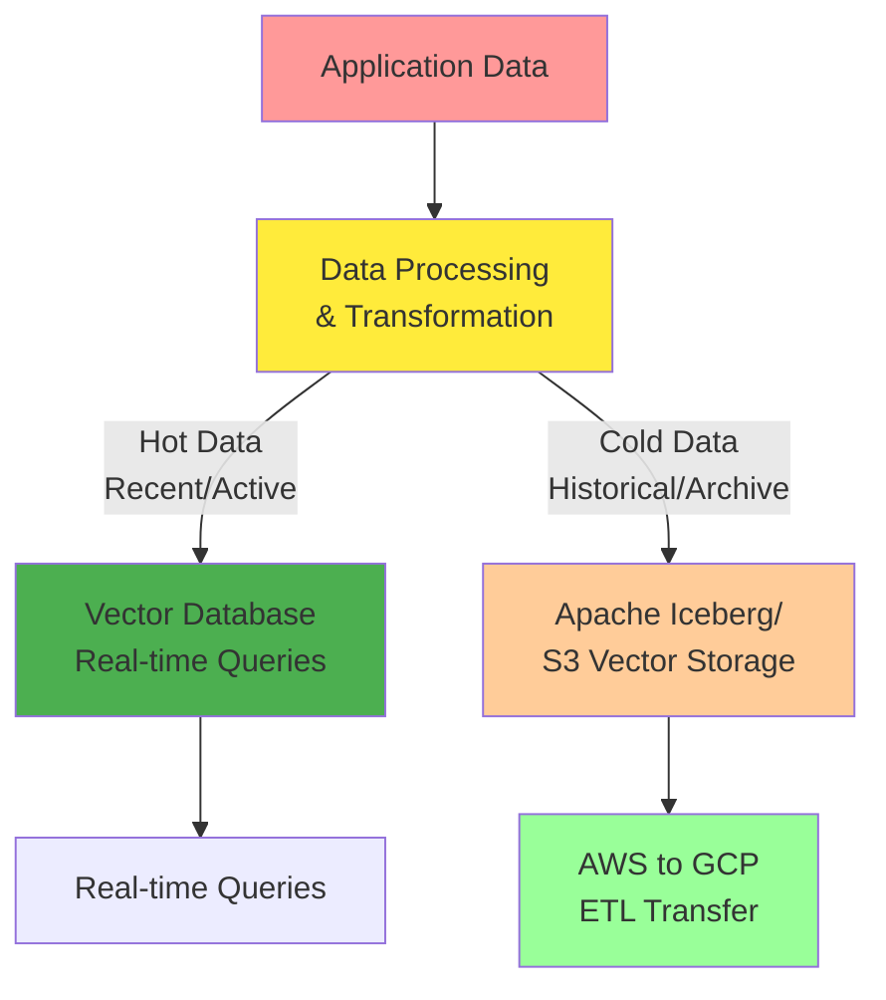
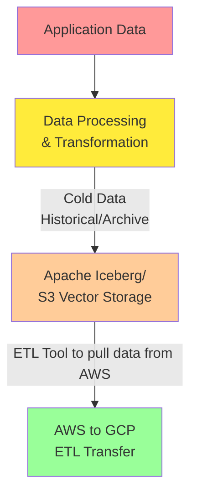

---
# You can also start simply with 'default'
theme: seriph
# random image from a curated Unsplash collection by Anthony
# like them? see https://unsplash.com/collections/94734566/slidev
background: https://cover.sli.dev
# some information about your slides (markdown enabled)
title: AI & Data Engineer Interview
info: |
  ## Technical Interview Presentation
  Showcasing Data Pipeline Engineering and Cross-Cloud Migration Expertise
  
  Demonstrating practical skills in AWS → GCP migration, ML pipelines, and orchestration

  Learn more at [Sli.dev](https://sli.dev)
# apply unocss classes to the current slide
class: text-center
# https://sli.dev/features/drawing
drawings:
  persist: false
# slide transition: https://sli.dev/guide/animations.html#slide-transitions
transition: slide-left
# enable MDC Syntax: https://sli.dev/features/mdc
mdc: true
# open graph
seoMeta:
  ogImage: https://cover.sli.dev
  ogTitle: AI & Data Engineer Interview
  ogDescription: Technical Interview Presentation - Data Pipeline Engineering and Cross-Cloud Migration
routerMode: hash

addons:
  - excalidraw

---

# AI & Data Engineer Technical Interview

**Building Scalable Cross-Cloud Data Infrastructure**

*Matthew Aylward, Milan Kuzmanovic PhD, Miloš Čalija*

  Press Space for next page <carbon:arrow-right />

  

    

      <carbon:cloud-upload class="text-4xl mb-2 text-blue-400" />
      Cross-Cloud Data Migration
    

    

      <carbon:data-structured class="text-4xl mb-2 text-green-400" />
      Production ML Pipelines
    

    

      <carbon:workflow-automation class="text-4xl mb-2 text-purple-400" />
      Enterprise Orchestration
    

  

  <button @click="$slidev.nav.openInEditor()" title="Open in Editor" class="slidev-icon-btn">
    <carbon:edit />
  </button>
  <a href="https://github.com/slidevjs/slidev" target="_blank" class="slidev-icon-btn">
    <carbon:logo-github />
  </a>

<!--
Welcome to this presentation that demonstrates my solution with cross-cloud data engineering, ML pipeline development, and production-ready orchestration systems.
-->

---
transition: fade-out
---

## Challenge

  <carbon:warning class="text-red-500 mx-auto mb-1 text-lg" />
  <strong class="text-sm block">Challenge</strong>
  
Enterprise data migration from AWS to GCP at scale

 

## Solution

  <carbon:light class="text-yellow-500 mx-auto mb-1 text-lg" />
  <strong class="text-sm block">Architecture</strong>
  
Modern lakehouse with Apache Iceberg & Parquet optimization

  <carbon:tools class="text-blue-500 mx-auto mb-1 text-lg" />
  <strong class="text-sm block">Technology</strong>
  
Python, Rust, Orchestration, Docker, Apache Iceberg

  <carbon:result class="text-green-500 mx-auto mb-1 text-lg" />
  <strong class="text-sm block">Impact</strong>
  
Production-ready pipeline, optimized for performance and cost

  <carbon:arrow-right class="text-purple-500 mx-auto mb-1 text-lg" />
  <strong class="text-sm block">Evolution</strong>
  
  
MLOps integration and real-time streaming capabilities

<!--
As you have outlined to me Milan, Nextesy will soon be moving large volumes of enterprise data from AWS to GCP for ML model processing. To ensure we can scale to any amount of clients, I proposed a modern lakehouse architecture leveraging Apache Iceberg for data storage and Parquet for efficient data serialization.
-->

---
transition: slide-up
layout: two-cols
layoutClass: gap-6
---
## Project Overview

**Challenge:** Moving Enterprise data from AWS → GCP for ML model processing

**Solution:** Modern Lakehouse architecture with Parquet optimization and Orchestration

  <h4 class="font-bold mb-2">Key Components:</h4>
  <ul class="text-sm space-y-1">
    <li>Enterprise data ingestion and processing</li>
    <li>High-performance Parquet compression with Rust</li>
    <li>Apache Iceberg lakehouse architecture</li>
    <li>Seamless AWS to GCP cross-cloud transfer</li>
    <li>Production-ready orchestration pipeline</li>
  </ul>

::right::

## Architecture Flow

  

  

<!--
We will have both Hot and Cold storage architecture for embeddings. Hot data for real-time low-latency access via a Vector DB, and Cold data for cost-effective archival storage. Also, once the data has been processed and stored in S3, we will transfer it to GCP for ML model processing.
-->

---
transition: fade-out
---

# Hot & Cold Storage Architecture for Embeddings

  

    
🔥 Hot Data Layer

    

      
< 50ms

      
Latency

    

    

      
🔍 Real-time search

      
📢 Live user interactions

    

    

      
Pinecone, Milvus

      
Traditional vector databases

    

  

  

    
❄️ Cold Data Layer

    

      
> 500ms

      
Latency

    

    

      
📦 Historical data archiving

      
🔍 Data lake queries

    

    

      
S3 + Apache Iceberg

      
Cost-optimized storage

    

  

  <h4 class="font-bold text-red-700 dark:text-red-300 mb-2 text-sm">🔥 Hot Storage (Pinecone)</h4>
  
10M vectors, 250k queries/month

  
$300–$500

  
Always-on, high-performance

  <h4 class="font-bold text-blue-700 dark:text-blue-300 mb-2 text-sm">❄️ Cold Storage (S3)</h4>
  
Same data, archival access

  
$30–$50

  
Pay-as-you-go model

  <h4 class="font-bold text-green-700 dark:text-green-300 mb-2 text-sm">💡 Hybrid Strategy</h4>
  
Hot + Cold tier optimization

  
70-90%

  
Total cost reduction

  

    Source: <a href="https://zilliz.com/blog/will-amazon-s3-vectors-kill-vector-databases-or-save-them" class="underline">Will Amazon S3 Vectors Kill Vector Databases or Save Them?</a>
  

--- 

# Cost Benefit Analysis - Parquet vs CSV

*~32k rows × 768-dim float32 embeddings, ~94 MB in memory*

| Format | Disk Size | Portability | Performance | Cost Impact |
|--------|-----------|-------------|-------------|-------------|
| **CSV** | ~630 MB | ✅ Any tool | ❌ Slow I/O | **High storage + transfer** |
| **Numpy** | ~95 MB | ⚠️ Limited metadata | ⚡ Fast | Neutral, lacks flexibility |
| **Parquet** | ~60 MB | ✅ Open standard | ⚡ Fast columnar | **Lowest cost, scalable** |

  <h4 class="font-bold text-green-700 dark:text-green-300 mb-2">✅ Parquet Benefits</h4>
  <ul class="text-xs space-y-1">
    <li>10x storage reduction vs CSV</li>
    <li>Zero-copy read with Polars</li>
    <li>Cross-platform compatibility</li>
    <li>Storage in Apache Iceberg</li>
  </ul>

  <h4 class="font-bold text-blue-700 dark:text-blue-300 mb-2">💰 AWS → GCP Transfer Cost</h4>
  <ul class="text-xs space-y-1">
    <li>CSV: 630 MB × $0.09/GB ≈ $0.06 per dataset</li>
    <li>Parquet: 60 MB × $0.09/GB ≈ $0.005 per dataset</li>
    <li class="font-bold text-green-600">~90% cheaper to move across clouds</li>
  </ul>

  

    Source: <a href="https://minimaxir.com/2025/02/embeddings-parquet/" class="underline">Embeddings & Parquet Performance Analysis</a>
  

--- 
layout: two-cols
layoutClass: gap-6
---

# ETL Implementation Details

  <h4 class="font-bold text-blue-600">Python Core Application</h4>
  
Data science workflows, API integration, ML preprocessing

  <h4 class="font-bold text-orange-600">Rust for Parquet Conversion</h4>
  
Performance-critical transformations, memory efficiency

  
Considering Lambda deployment for serverless scaling

  <h4 class="font-bold text-green-600">Source of Truth: Apache Iceberg in AWS</h4>
  
Source of truth for data lake, enabling ACID transactions

  <h4 class="font-bold text-purple-600">Prefect Orchestration</h4>
  
Workflow management, retry logic, observability, scheduling

::right::

---
layout: two-cols
layoutClass: gap-4
---

## 📈 Scaling Architecture

  

    <strong>Distributed Parallel Processing</strong>
    
Orchestration-orchestrated parallel task execution with intelligent batching for optimal throughput

  

  
  

    <strong>Serverless Auto-Scaling</strong>
    
AWS Lambda deployment for Rust converters enabling elastic scaling based on demand

  

  
  

    <strong>Future: Hybrid Processing Strategy</strong>
    
Streams for real-time analytics, batch processing for high-volume historical data

  

::right::

## 🚀 Production MLOps Pipeline

  

    <strong class="text-blue-600">GCP AI Platform Integration</strong>
    
Managed ML model serving with auto-scaling inference and built-in monitoring

  

  
  

    <strong class="text-purple-600">Containerized Model Deployment</strong>
    
Docker-based deployments with semantic versioning and rollback capabilities

  

  
  

    <strong class="text-green-600">Continuous Model Validation</strong>
    
A/B testing framework with automated performance tracking and model drift detection

  

--- 
transition: fade-out
---

# Potential Hazards

Cloud Lock-in

Mitigation Strategies:
- Use open standards (Apache Iceberg, Parquet)
- Abstract cloud-specific APIs
- Containerization with Docker
- Multi-cloud orchestration with Prefect
 

---
class: px-20
---

# Strategic Thinking: Business Impact

  

    <carbon:dashboard class="text-3xl mb-3" />
    <h3 class="font-bold mb-2">Observability</h3>
    <ul class="text-sm space-y-1">
      <li>Prometheus metrics</li>
      <li>CloudWatch/GCP monitoring</li>
      <li>Custom data quality alerts</li>
      <li>Pipeline SLA tracking</li>
    </ul>
  

  

    <carbon:deployment-unit-technical-execution class="text-3xl mb-3" />
    <h3 class="font-bold mb-2">CI/CD for Data</h3>
    <ul class="text-sm space-y-1">
      <li>Automated ETL testing</li>
      <li>Schema validation</li>
      <li>Data quality gates</li>
      <li>Deployment automation</li>
    </ul>
  

  

    <carbon:growth class="text-3xl mb-3" />
    <h3 class="font-bold mb-2">Business Value</h3>
    <ul class="text-sm space-y-1">
      <li>Faster ML model iteration</li>
      <li>Reduced data processing costs</li>
      <li>Improved decision latency</li>
      <li>Cross-cloud flexibility</li>
    </ul>
  

<!--
Shows enterprise-level thinking about data engineering operations and business impact
-->

---

# Technical Q&A

  <strong class="text-red-700 dark:text-red-300">Q: "How do you handle failures?"</strong>
  

    <strong>A:</strong> "Prefect provides built-in retry logic with exponential backoff. I implement circuit breakers, dead letter queues, and comprehensive logging with correlation IDs for debugging."
  

  <strong class="text-blue-700 dark:text-blue-300">Q: "How do you scale this to thousands per day?"</strong>
  

    <strong>A:</strong> "Parallel processing with Prefect Orchestration, serverless Rust functions on Lambda for auto-scaling, and choosing between batch vs streaming based on latency requirements."
  

  <strong class="text-purple-700 dark:text-purple-300">Q: "How do you secure data during transfer?"</strong>
  

    <strong>A:</strong> "End-to-end encryption, IAM roles with least privilege, VPC endpoints for private communication, and comprehensive audit logging."
  

